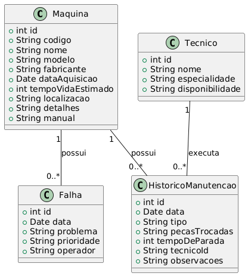
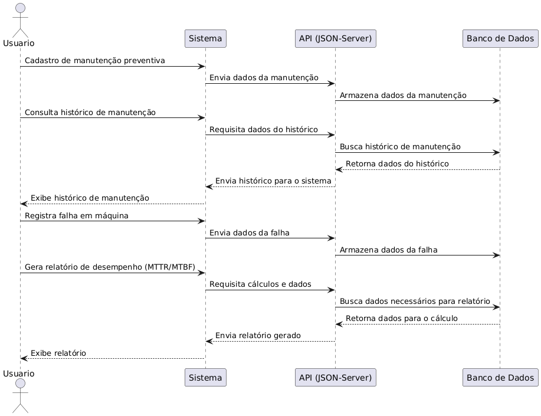

# Sistema de Manutenção Preventiva e Corretiva

## 1. Definição do Tema
O Sistema de Manutenção Preventiva e Corretiva é um software destinado ao gerenciamento do ciclo de vida de máquinas e equipamentos industriais, com foco em minimizar o tempo de inatividade e otimizar a performance operacional. Ele permite o controle das manutenções preventivas (realizadas regularmente para evitar falhas) e corretivas (realizadas após uma falha). O sistema também inclui funcionalidades para registrar falhas, gerenciar técnicos, gerar relatórios e acompanhar indicadores de desempenho, como o MTTR (Mean Time to Repair - Tempo Médio de Reparo) e o MTBF (Mean Time Between Failures - Tempo Médio Entre Falhas).

## 2. Análise de Requisitos e Escopo

### Funcionalidades Principais:

#### Gerenciamento de Máquinas e Equipamentos:
- Cadastro de máquinas, incluindo especificações técnicas, data de aquisição e localização.
- Visualização e edição de informações de máquinas.

#### Registro e Controle de Manutenções:
- Registro de manutenções preventivas e corretivas.
- Histórico completo de manutenções para cada máquina.
- Registro de peças substituídas e tempo de inatividade.

#### Gerenciamento de Falhas:
- Registro de falhas ocorridas, classificando a severidade e identificando o operador.
- Controle de falhas por máquina.

#### Gerenciamento de Técnicos:
- Cadastro de técnicos, incluindo suas especialidades e disponibilidade.

#### Relatórios e Indicadores:
- Geração de relatórios de manutenção, tempo de inatividade, falhas e peças trocadas.
- Cálculo de indicadores como MTTR e MTBF.

#### Integração com API:
- Utilização de uma API REST (JSON-Server) para armazenar e recuperar dados.

## 3. Escopo

O sistema de Manutenção Preventiva e Corretiva em Java será projetado para gerenciar máquinas e equipamentos industriais, garantindo um ciclo de manutenção eficiente e o mínimo de tempo de inatividade. O escopo envolve a implementação de funcionalidades para cadastro de máquinas, controle de manutenções, gerenciamento de falhas e técnicos, além da geração de relatórios e indicadores de desempenho.

### 3.1 Objetivos
- **Reduzir o tempo de inatividade**: Minimizar o tempo em que as máquinas estão fora de operação, garantindo manutenção eficiente.
- **Otimizar a performance operacional**: Manter máquinas e equipamentos em condições ideais de funcionamento.
- **Registrar e gerenciar falhas**: Classificar e documentar falhas para melhorar a manutenção corretiva.
- **Acompanhar indicadores de desempenho**: Calcular e monitorar indicadores como MTTR e MTBF para avaliar a eficiência das manutenções.
- **Gerar relatórios detalhados**: Fornecer relatórios sobre histórico de manutenções, tempo de inatividade e desempenho dos técnicos.

### 3.2 Levantamento de Recursos
- **Software**: Ambiente de desenvolvimento Java (como Eclipse ou IntelliJ), JSON-Server para simular API REST, biblioteca para relatórios (por exemplo, JasperReports).
- **Hardware**: Computadores ou servidores para executar e testar o sistema.
- **Equipe**: Desenvolvedores com experiência em Java, técnicos de manutenção para validar funcionalidades e requisitos.

### 3.3 Análise de Riscos
- **Dependência de hardware específico**: Testar em diferentes configurações para garantir compatibilidade.
- **Confiabilidade dos dados**: Garantir que o armazenamento e a recuperação de dados pelo JSON-Server sejam robustos e eficientes.
- **Complexidade na gestão de falhas**: Definir bem os critérios de severidade e classificação para evitar ambiguidades e problemas na gestão das manutenções.
- **Escalabilidade**: Planejar a arquitetura do sistema para que ele possa ser ampliado, caso mais máquinas e técnicos sejam adicionados futuramente.

Diagramas de Classe:
{
    "maquinas": [
      {
        "id": 1,
        "codigo": "M001",
        "nome": "Torno CNC",
        "modelo": "CNC 3000",
        "fabricante": "Siemens",
        "dataAquisicao": "2020-01-10",
        "tempoVidaEstimado": 10,
        "localizacao": "Linha 1",
        "detalhes": "Operação em alta precisão",
        "manual": "URL do manual"
      }
    ],
    "historicoManutencao": [
      {
        "id": 1,
        "maquinaId": 1,
        "data": "2024-10-07",
        "tipo": "Preventiva",
        "pecasTrocadas": "Correia",
        "tempoDeParada": 4,
        "tecnicoId": "João Silva",
        "observacoes": "Substituição preventiva da correia."
      }
    ],
    "falhas": [
      {
        "id": 1,
        "maquinaId": 1,
        "data": "2024-09-28",
        "problema": "Falha no motor",
        "prioridade": "Alta",
        "operador": "Carlos Lima"
      }
    ],
    "tecnicos": [
      {
        "id": 1,
        "nome": "João Silva",
        "especialidade": "Mecânica",
        "disponibilidade":"Livre"
      }
    ]
  }

  IMAGEM: 

DIAGRAMA DE SEQUÊNCIA:

IMAGEM: 
